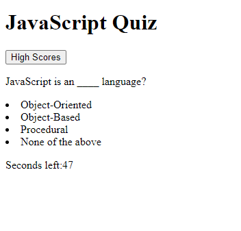

# JavaScript-Fundamentals-Quiz
## Description
A five question game about JavaScript fundemental. On the home screen an input test is provided for the user to ender thier name.
Once the start button is clicked a question is displayed along with four choices. Below the answers is a timer that will start counting down. If any question is answered incorrect then 10 seconds is taken off the timer. Once all the questions have need answered or if the timer has run out the quiz ends. The score will then be displayed, and the user name and score is stored in local storage.

## Screenshot

## Links
[Link to website](https://spcsanti1990.github.io/JavaScript-Fundamentals-Quiz/)
